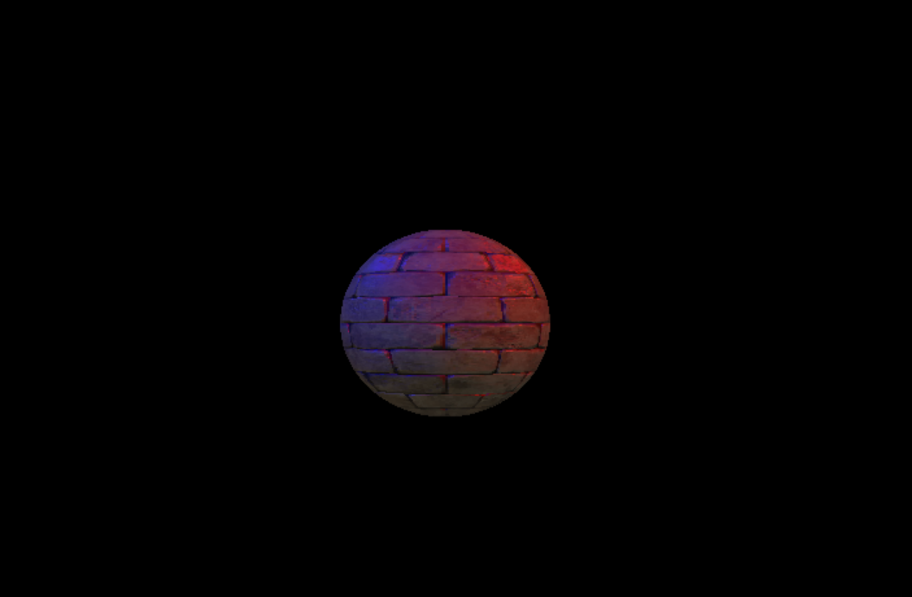

# Author: SCTMIC015

## Set Up information:

Set up instructions are for a machine running windows 10/11. Although a similar procedure would apply in linux

Setup within a virtual environment on windows is as follows.
Assuming that python3 and python3-venv installed.

All instructions are exectuted from within the SCTMIC015Ass2 directory:

1) To build the virtual environment and install necessary packages using a python script:

```
> python3 MakeWindows.py
```

2) To activate the virtual environment:

```
> ./venv/Scripts/activate

```

3) To run the skeleton code:

- To load the default object ("sphere.obj") with the default image texture ("brickwall.jpg") and corresponding normal map ("brickwall_normal.jpg")
```
> python3 ./src/main.py
```

You should see the following output


- To select an object and image and normal map

```
> python3 ./src/main.py "objectname" "textureImage" "normalMap"
```
For Example to load suzanne as an object with brickwall image and normal map we would type python ./src/main.py "suzanne.obj" "brickwall.jpg" "brickwall_normal.jpg"

**Note**: Step 3 should work on both a windows and linux distribution outside of a virtual environment 
provided the correct packages are installed.

**Note 2**: You can try use the setup described in the initial ReadMe provided. If you can get it 
working for the base skeleton provided it should work for mine as well. 

## Notes on implementation

- Lights

By default the lights are set in the positions of [3, 3, 3] for the red light and [-3, 3, 3] for the blue light.
Rotating the lights will cause them to rotate in a circe at three units above the object starting at the two points
above. The radius is 3 times root 2.  

- Camera

By default the camera is positioned at [0, 0, 9]. It can rotate directly around the object with a radius of 9. 

- Obj

The default object model is a sphere created in blender as I believe it shows the lights working the best.

## Key Presses
 
The appropriate Key presses to control the program

Task | Keys |
--- | --- |
Scale Up | + Key  |
Scale Down | - Key |
Rotate around X axis | x Key |
Rotate around Y axis | y Key |
Rotate around Z axis | Z key |
stop rotation | s key |
Reset Scene | r Key|
Rotate camera | c key starts and stops rotation|
Rotate lights |l key starts and stops rotation|
Quite program | q Key |

## Sources 

The implementation of the bump mapping was done using a variety of sources. Namely https://www.youtube.com/playlist?list=PLn3eTxaOtL2PDnEVNwOgZFm5xYPr4dUoR was followed 
to correctly load the tangent and bitangents in the geometry class. I partially followed the first method in the
learnopengl.com tutorial for my implementation. 